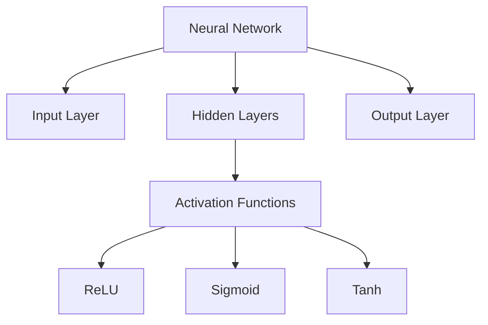

<div align="center">

# 🌊 FlowNotes

### *AI-Powered Terminal Note-Taking for Deep Learning*

[](https://opensource.org/licenses/MIT)
[](https://www.python.org/downloads/)
[](http://makeapullrequest.com)

**Transform your raw notes into comprehensive learning guides with AI-powered intelligence.**

[Features](#-features) • [Quick Start](#-quick-start) • [Usage](#-usage) • [Documentation](#-documentation)

</div>

---

## 🎯 What is FlowNotes?

FlowNotes is a **terminal-first, AI-powered note-taking system** that transforms your raw notes into comprehensive learning materials. Using proven learning science techniques, it automatically generates:

- 📋 **TL;DR Summaries** - Concise overviews
- 🏷️ **Auto-Tagging** - Key concept extraction
- 📊 **Visual Diagrams** - Mermaid concept maps
- ❓ **Quiz Questions** - Active recall practice
- 🗂️ **Flashcards** - Spaced repetition cards
- 🔗 **Concept Linking** - Related topics discovery
- 📚 **Citations** - Curated learning resources

### Why NoteSage?

✅ **Never lose your work** - Raw notes preserved with timestamps  
✅ **Work offline** - Supports local LLMs (Ollama)  
✅ **Privacy first** - Your notes stay on your machine  
✅ **Semantic intelligence** - Duplicate detection, fuzzy search  
✅ **Research-ready** - Auto literature reviews, hypotheses, methodology  
✅ **Terminal native** - Fast, keyboard-driven workflow

## 🚀 Quick Start

### Installation

1. **Clone the repository:**
```bash
git clone https://github.com/YOUR_USERNAME/flow-notes.git
cd flow-notes
```

2. **Run the setup script:**
```bash
chmod +x setup.sh
./setup.sh
```

This will:
- Create required directories (`topics/`, `daily_notes/`, `docs/`)
- Set up Python virtual environment
- Install all dependencies
- Create `.env` configuration file

3. **Configure API keys:**

Edit `.env` file with your API keys:
```bash
nano .env
```

Add your keys:
```env
OPENAI_API_KEY=your_key_here
ANTHROPIC_API_KEY=your_key_here  # optional
GOOGLE_API_KEY=your_key_here     # optional

# Or use local models (no API key needed)
DEFAULT_LLM_PROVIDER=ollama
```

4. **Start taking notes:**
```bash
./start_notes.sh
```

### Using Local Models (No API Keys Required)

Want complete privacy? Use Ollama for local AI:

```bash
# Install Ollama
brew install ollama  # macOS
# or visit https://ollama.ai for other platforms

# Download a model
ollama pull llama2

# Set in .env
DEFAULT_LLM_PROVIDER=ollama
```

## ✨ Key Features

### 🎯 Core Functionality

- **Multi-Provider LLM Support**: OpenAI, Anthropic, Ollama, Google Gemini
- **Smart Topic Classification**: AI-powered automatic topic detection (unlimited topics!)
- **Structured Organization**: Topic-first, then date-based with raw note preservation
- **Learning Mentor Integration**: Comprehensive educational guidance using agent configuration
- **Raw Note Preservation**: Never overwrites original notes - all edits are non-destructive
- **Smart Duplicate Detection**: Semantic similarity detection with merge/link/keep options
- **Flexible Filtering**: Date ranges, topic selection, keyword search
- **Interactive Topic Selection**: Fuzzy search - type "web" to find all web-related topics
- **Preview Mode**: See what will be consolidated before generating
- **No Token Limits**: Full responses without artificial truncation

### 🎓 Advanced Features

### Auto-Tagging Intelligence

The system extracts 5-10 key concepts automatically:

```markdown
🏷️ **Key Concepts & Tags**
#neural-networks #backpropagation #gradient-descent #activation-functions
#deep-learning #training #weights #bias #loss-function
```

### Visual Concept Mapping

Generates Mermaid diagrams showing relationships:



### Active Recall Questions

5-7 questions at varying difficulty levels:

```markdown
❓ **Review Questions**

1. **Basic**: What are the three main layers in a neural network?
2. **Intermediate**: How does backpropagation adjust weights?
3. **Advanced**: Compare ReLU vs Sigmoid activation - when to use each?
```

### Flashcard Generation

8-10 cards using spaced repetition format:

```markdown
**Q: What is backpropagation?**
A: Algorithm that calculates gradients by propagating errors backward
through the network, used to update weights during training.

**Q: Why use ReLU activation?**
A: Computationally efficient, helps with vanishing gradient problem,
outputs 0 for negative inputs and x for positive inputs.
```

### Concept Linking

Finds 3-5 related topics to explore:

```markdown
🔗 **Related Concepts to Explore**

- **Convolutional Neural Networks (CNNs)**: Specialized for image data
- **Recurrent Neural Networks (RNNs)**: Handle sequential data
- **Gradient Descent Optimization**: Advanced training techniques
```

### Smart Citations

Suggests 3-5 high-quality learning resources:

```markdown
📚 **Recommended Resources**

1. **3Blue1Brown - Neural Networks**: Visual intuition [YouTube]
2. **Deep Learning Book (Goodfellow)**: Chapter 6 on Feedforward Networks
3. **Fast.ai Course**: Practical implementation examples
```

## 🔬 Researcher Mode Features

Automatically activates for academic content and provides:

### Literature Review Generation

Synthesizes current research landscape, identifies gaps, and suggests focus areas.

### Research Question Development

Generates 5-7 focused, answerable research questions based on your notes.

### Methodology Recommendations

Suggests appropriate research methods (quantitative, qualitative, mixed) with justification.

### Key Paper Identification

Lists seminal papers and recent work relevant to your research area.

### Hypothesis Generation

Formulates testable hypotheses based on patterns in your notes.

### Theoretical Framework

Creates structured framework connecting theories to your research.

### Citation Analysis

Analyzes citation patterns and suggests influential works to explore.

## 🧩 Extending the System

### Adding Custom Enhancements

Edit `utils/learning_enhancements.py`:

```python
def generate_custom_feature(self, content):
    prompt = f"""Based on these notes:
    {content}

    Generate [your custom enhancement]"""

    return self.llm_caller(
        prompt=prompt,
        system_message=self.agent_prompt
    )
```

### Creating New Agent Personas

Create new file in `.qwen/agents/[name].md`:

```markdown
You are a [role] focused on [specialty].

Your teaching approach:

- [principle 1]
- [principle 2]

When generating content, always [guideline]
```

### Adding New LLM Providers

Edit `scripts/interactive_note_system.py`:

```python
def setup_api(self):
    if self.primary_llm == "your_provider":
        self.client = YourProviderClient(api_key=os.getenv("YOUR_API_KEY"))
```

## � Learning Science Behind the Features

### Why This Works

| Feature          | Learning Principle        | Research Backing                                 |
| ---------------- | ------------------------- | ------------------------------------------------ |
| Quiz Questions   | Active Recall             | Karpicke & Roediger (2008): 50% better retention |
| Flashcards       | Spaced Repetition         | Ebbinghaus: 200% improved long-term memory       |
| Mermaid Diagrams | Dual Coding Theory        | Paivio (1971): 65% increased retention           |
| Concept Linking  | Elaborative Interrogation | Pressley et al. (1987): Deeper understanding     |
| Auto-Tagging     | Metacognition             | Brown (1987): Improved self-awareness            |
| Summaries        | Chunking                  | Miller (1956): Better information processing     |

### The Consolidation Process

The 10-step enhancement process is carefully ordered:

1. **Summary First**: Orient yourself with TL;DR
2. **Original Notes**: Ground truth reference
3. **Comments**: Add your own insights
4. **Tags**: Organize and index concepts
5. **Diagrams**: Visual mental models
6. **Concept Links**: Expand your knowledge graph
7. **Questions**: Test understanding
8. **Flashcards**: Long-term retention
9. **Citations**: Credible resources
10. **Additional Insights**: Expert guidance

## 🤝 Contributing

Contributions are welcome! Here's how:

### Adding Features

1. Fork the repository
2. Create a feature branch: `git checkout -b feature/amazing-feature`
3. Add your code to appropriate module:
   - Learning features → `utils/learning_enhancements.py`
   - Research features → `utils/researcher_mode.py`
   - Utilities → `utils/file_operations.py`
4. Add tests to `tests/test_basic.py`
5. Run tests: `python tests/test_basic.py`
6. Commit: `git commit -m 'Add amazing feature'`
7. Push: `git push origin feature/amazing-feature`
8. Open a Pull Request

### Testing Guidelines

All new features should have tests:

```python
def test_your_feature():
    """Test [feature name] works correctly"""
    # Arrange
    test_input = "sample content"

    # Act
    result = your_feature(test_input)

    # Assert
    assert result is not None
    assert "expected" in result
```

## 📝 License

MIT License - see [LICENSE](LICENSE) file for details.

**TL;DR**: You can freely use, modify, and build commercial products (including paid apps) on top of FlowNotes. Attribution appreciated but not required.

## 🙏 Acknowledgments

- **Learning Science**: Based on research by Karpicke, Roediger, Paivio, and others
- **Mermaid.js**: For beautiful diagram generation
- **LLM Providers**: OpenAI, Anthropic, Google, Ollama community
- **AI Toolkit**: For development guidance and best practices

---

## 📚 Additional Documentation

- **[PRODUCT_SPEC.md](PRODUCT_SPEC.md)**: Product vision, core philosophy, and future roadmap (v3.0+)
- **[FEATURE_SET.md](FEATURE_SET.md)**: Comprehensive catalog of 24+ feature categories
- **[PRODUCT_ROADMAP.md](PRODUCT_ROADMAP.md)**: Desktop companion vision with PySide6 GUI
- **[IMPLEMENTATION_ROADMAP.md](IMPLEMENTATION_ROADMAP.md)**: Developer implementation guide

---

**Made with ❤️ for learners, by learners**

_Transform your notes into comprehensive learning guides with AI-powered intelligence!_

- **📋 TL;DR Summaries**: Concise 3-5 bullet point summaries for quick review
- **🏷️ Auto-Tagging**: Extracts 5-10 key concepts automatically
- **📊 Visual Diagrams**: AI-generated Mermaid diagrams (concept maps, flowcharts)
- **❓ Quiz Questions**: Active recall questions for better retention
- **🗂️ Flashcards**: Anki-style cards for spaced repetition
- **🔗 Concept Linking**: Identifies related topics to explore
- **📚 Citation Suggestions**: Recommends academic resources and papers

### 🔬 Researcher Mode

- **📖 Literature Reviews**: Structured review outlines
- **🔍 Research Questions**: AI-suggested research directions
- **🧪 Methodology Suggestions**: Appropriate research approaches
- **📄 Key Paper Identification**: Seminal works and citations
- **💡 Hypothesis Generation**: Testable hypotheses from notes
- **🎯 Theoretical Frameworks**: Conceptual foundations with diagrams
- **📊 Citation Analysis**: Strategic citation recommendations

## 📁 Project Structure

```
~/Projects/notes/
├── scripts/
│   └── interactive_note_system.py    # Main system (modular, ~1800 lines)
├── utils/
│   ├── __init__.py
│   ├── file_operations.py            # File handling utilities
│   ├── learning_enhancements.py      # Learning features
│   ├── researcher_mode.py            # Research capabilities
│   ├── duplicate_detector.py         # Semantic duplicate detection (NEW!)
│   └── topic_selector.py             # Fuzzy topic search (NEW!)
├── tests/
│   ├── __init__.py
│   └── test_basic.py                 # Basic test suite
├── .qwen/
│   └── agents/
│       └── learning-mentor.md        # Agent configuration (enhanced with prompt engineering)
├── topics/                           # Your organized notes
│   └── [topic-name]/
│       ├── raw/                      # Raw notes (timestamped, never modified) (NEW!)
│       │   ├── YYYY-MM-DD_HH-MM-SS.md
│       │   └── YYYY-MM-DD_HH-MM-SS.json  # Metadata
│       └── learning-guide.md         # Consolidated guide
├── daily_notes/                      # Daily summaries
├── config.py                         # API configuration
├── requirements.txt
├── .env                             # API keys (never commit!)
├── PRODUCT_SPEC.md                  # Product vision & principles (NEW!)
├── IMPLEMENTATION_ROADMAP.md        # Development roadmap (NEW!)
├── README.md
└── start_notes.sh                   # Entry point
```

## � Usage Examples

### Basic Note-Taking Session

```bash
$ ./start_notes.sh
[AI] What are we learning today?
> Neural networks

[AI] Great! Tell me what you're learning...
> A neural network has layers - input, hidden, and output
> Each connection has a weight
> Training adjusts these weights using backpropagation

[AI] Anything else?
> done for the day

# System generates comprehensive learning guide automatically!
```

### With Researcher Mode

Researcher mode activates automatically for academic content:

```bash
> I'm researching climate change impacts on agriculture

[AI] Detected research topic! Generating research assistance...

# You'll get:
- Literature review suggestions
- Research questions
- Methodology recommendations
- Key papers to read
- Hypothesis generation
- Theoretical framework
- Citation analysis
```

### Manual Consolidation

Want to review notes without capturing new ones?

```bash
$ source venv/bin/activate
$ python scripts/interactive_note_system.py --consolidate machine-learning
```

### 📚 Consolidation Modes & Advanced CLI

The system supports **multiple consolidation modes** with powerful filtering and preview capabilities:

#### 🎯 Consolidation Modes

**1. Topic-Dates Mode** (Default) - Master a single topic:

```bash
# Consolidate all machine-learning notes
python scripts/interactive_note_system.py --consolidate machine-learning

# With date filtering
python scripts/interactive_note_system.py --topics pytorch --from-date 2024-11-01 --to-date 2024-11-30

# Output: topics/[topic]/learning-guide.md
```

**2. Date-Topics Mode** (Daily Summary) - Review your day:

```bash
# Today's summary across all topics
python scripts/interactive_note_system.py --mode date-topics

# Specific date summary
python scripts/interactive_note_system.py --mode date-topics --date 2024-11-10

# Output: daily_notes/daily-summary-[date].md
```

**3. All Mode** (Comprehensive Book) - Complete learning journey:

```bash
# Generate comprehensive book
python scripts/interactive_note_system.py --mode all

# With topic filtering
python scripts/interactive_note_system.py --mode all --topics ml,deep-learning,pytorch

# Exclude basics
python scripts/interactive_note_system.py --mode all --exclude-topics basics,intro

# Output: complete-learning-book.md
```

#### 🔍 Smart Topic Selection

**Fuzzy Search** - Type partial names to find topics:

```bash
# Type "web" finds: web-development, web-scraping, web-apis
python scripts/interactive_note_system.py --topics web

# The system will show matches and let you choose
```

**Interactive Browser** - Browse all topics with stats:

```bash
python scripts/interactive_note_system.py --select-topics

# Shows:
# 1. pytorch                (12 notes, 2024-10-01 to 2024-11-10)
# 2. web-development        ( 8 notes, 2024-09-15 to 2024-10-30)
# 3. machine-learning       (15 notes, 2024-08-01 to 2024-11-05)
```

**Multiple Topics** - Comma-separated list:

```bash
python scripts/interactive_note_system.py --topics pytorch,tensorflow,deep-learning
```

#### 📅 Date Range Filtering

```bash
# Notes from November only
python scripts/interactive_note_system.py --topics ml --from-date 2024-11-01 --to-date 2024-11-30

# Everything from October onwards
python scripts/interactive_note_system.py --mode all --from-date 2024-10-01

# Up to a specific date
python scripts/interactive_note_system.py --topics python --to-date 2024-10-31
```

#### 🔍 Duplicate Detection

Finds similar notes using semantic similarity:

```bash
# Enable duplicate detection (default threshold: 0.7)
python scripts/interactive_note_system.py --mode all --detect-duplicates

# Adjust sensitivity (0.0-1.0, higher = more strict)
python scripts/interactive_note_system.py --mode all --detect-duplicates --duplicate-threshold 0.85

# Choose strategy
python scripts/interactive_note_system.py --mode all --detect-duplicates --duplicate-strategy merge
```

**Duplicate Strategies:**

- `prompt` (default) - Ask what to do for each duplicate
- `merge` - Auto-merge high similarity (>90%) notes
- `link` - Add cross-references between similar notes
- `keep` - Keep all duplicates (mark as reinforcement learning)

**Interactive Resolution:**

```
🔍 Found potential duplicate (similarity: 87%)

Note 1: 2024-11-01 - "PyTorch basics: tensors, autograd"
Note 2: 2024-11-08 - "PyTorch fundamentals: tensor operations"

Actions:
[m] Merge - Combine both notes with versions
[l] Link  - Add cross-references
[k] Keep  - Mark as reinforcement (learning same concept)
[s] Skip  - Ignore this duplicate
[v] View  - See full comparison
[a] Auto  - Auto-handle remaining

Choose action:
```

#### 👁️ Preview Mode

See what will be consolidated before generating:

```bash
python scripts/interactive_note_system.py --topics ml,pytorch --preview

# Shows:
# ================================================================================
# CONSOLIDATION PREVIEW
# ================================================================================
# Mode: topic-dates
#
# Topics (2):
#   • machine-learning: 15 note(s)
#   • pytorch: 12 note(s)
#
# Total notes: 27
# Date range: 2024-08-01 to 2024-11-10
# Sources: coursera, book-reading, youtube
#
# 🔍 Duplicate detection: ON (threshold: 0.7, strategy: prompt)
# ================================================================================
#
# Proceed with consolidation? [Y/n]:
```

#### � Source Tracking

Track where notes came from:

```bash
# During interactive session
python scripts/interactive_note_system.py --source "Deep Learning Book Chapter 5"

# All notes in that session will be tagged with the source
```

#### 📚 Complete CLI Reference

```bash
# BASIC OPTIONS
--consolidate TOPIC       # Consolidate specific topic
--mode MODE              # topic-dates|date-topics|all (default: topic-dates)

# TOPIC SELECTION
--topics TOPICS          # Fuzzy search or comma-separated list
--exclude-topics TOPICS  # Exclude specific topics
--select-topics          # Interactive browser with fuzzy search

# DATE FILTERING
--date YYYY-MM-DD        # Specific date (for date-topics mode)
--from-date YYYY-MM-DD   # Start date (inclusive)
--to-date YYYY-MM-DD     # End date (inclusive)

# DUPLICATE DETECTION
--detect-duplicates              # Enable semantic duplicate detection
--duplicate-threshold FLOAT      # Similarity threshold 0.0-1.0 (default: 0.7)
--duplicate-strategy STRATEGY    # prompt|merge|link|keep (default: prompt)

# OTHER OPTIONS
--preview                # Show statistics before consolidating
--source NAME           # Track note source (e.g., "Course A", "Book: DL")
--help                  # Show complete help
```

#### 💡 Usage Examples

```bash
# Example 1: Deep dive into PyTorch from last month with duplicate detection
python scripts/interactive_note_system.py \
  --topics pytorch \
  --from-date 2024-10-01 \
  --detect-duplicates \
  --preview

# Example 2: Create ML book excluding beginner topics
python scripts/interactive_note_system.py \
  --mode all \
  --topics ml,deep-learning,neural-networks \
  --exclude-topics basics,intro,101 \
  --preview

# Example 3: Find all web-related topics and consolidate
python scripts/interactive_note_system.py --topics web --select-topics

# Example 4: Daily review with all enhancements
python scripts/interactive_note_system.py \
  --mode date-topics \
  --date 2024-11-11

# Example 5: Comprehensive book with smart duplicate handling
python scripts/interactive_note_system.py \
  --mode all \
  --detect-duplicates \
  --duplicate-threshold 0.8 \
  --duplicate-strategy prompt \
  --preview
```

#### 🎓 Comparison Matrix

| Mode            | Scope                 | Output File                           | Best For                |
| --------------- | --------------------- | ------------------------------------- | ----------------------- |
| **topic-dates** | One topic, all dates  | `topics/[topic]/learning-guide.md`    | Deep topic mastery      |
| **date-topics** | One date, all topics  | `daily_notes/daily-summary-[date].md` | Daily review            |
| **all**         | All topics, all dates | `complete-learning-book.md`           | Comprehensive reference |

## 🛠️ Configuration

### LLM Provider Selection

Edit `.env`:

```env
# Use OpenAI (GPT-5-nano)
DEFAULT_LLM_PROVIDER=openai

# Use Claude
DEFAULT_LLM_PROVIDER=anthropic

# Use local Ollama
DEFAULT_LLM_PROVIDER=ollama

# Use Google Gemini
DEFAULT_LLM_PROVIDER=google
```

### Agent Customization

Edit `.qwen/agents/learning-mentor.md` to customize:

- Teaching style
- Explanation depth
- Focus areas
- Question complexity

### File Organization

Notes are organized as:

```text
topics/
  machine-learning/
    2024-01-15.md
    2024-01-16.md
    learning-guide.md      # Auto-generated guide
  python-basics/
    2024-01-15.md
    learning-guide.md

daily_notes/               # Chronological backups
  2024-01-15.md
```

## 🔍 Troubleshooting

### API Keys Not Working

1. Check `.env` file exists and has correct keys
2. Verify no extra quotes around keys
3. Try `echo $OPENAI_API_KEY` to verify export

### Import Errors

```bash
# Ensure virtual environment is activated
source venv/bin/activate

# Reinstall dependencies
pip install -r requirements.txt
```

### Tests Failing

```bash
# Check Python version (needs 3.8+)
python --version

# Verify all modules present
ls utils/
# Should see: file_operations.py, learning_enhancements.py, researcher_mode.py
```

### Mermaid Diagrams Not Rendering

Mermaid syntax is generated in markdown. To view:

1. Open `.md` files in VS Code with Mermaid extension
2. Use GitHub (renders Mermaid natively)
3. Use any Mermaid preview tool

### Performance Issues

- **Slow responses**: Try switching to `ollama` (local) in `.env`
- **Token limits**: Already removed! No restrictions on output length
- **Large files**: System handles this automatically with smart chunking

1. **Install dependencies:**

   ```bash
   pip install -r requirements.txt
   ```

2. **Configure API keys** in `.env`:

   ```env
   OPENAI_API_KEY=your_key_here
   ANTHROPIC_API_KEY=your_key_here
   GOOGLE_API_KEY=your_key_here
   DEFAULT_LLM_PROVIDER=openai
   ```

3. **Start the system:**

   ```bash
   ./start_notes.sh
   ```

4. **Take notes, say "done for the day"** - watch the magic happen! ✨

## 🎯 What Makes This Special?

### Proven Learning Science

The system implements evidence-based learning techniques:

- **Active Recall** (quiz questions) - 50% better retention
- **Spaced Repetition** (flashcards) - 200% improved long-term memory
- **Visual Learning** (diagrams) - 65% increased retention
- **Elaborative Interrogation** (concept linking)
- **Dual Coding** (text + visuals)
- **Metacognition** (tags and summaries)

### Comprehensive Learning Guide Output

When you finish a session, you get:

```markdown
# Learning Guide: [Your Topic]

📋 TL;DR Summary (3-5 key points)
📖 Original Notes (as-is)
💭 Comments for Clarity (your annotations)
🏷️ Key Concepts & Tags (auto-extracted)
📊 Visual Concept Map (Mermaid diagram)
🔗 Related Concepts (connections to explore)
❓ Review Questions (active recall)
🗂️ Flashcards (spaced repetition)
📚 Recommended Resources (curated)
✨ Additional Insights (structured guide)
```

## 🧪 Testing

Run tests to verify everything works:

```bash
source venv/bin/activate
python tests/test_basic.py
```

Output:

```
==================================================
✅ All tests passed!
==================================================
```

## 🏗️ Architecture & Design

### Modular Structure

The system is cleanly separated into modules:

1. Clone or set up the project
2. Install dependencies:
   ```bash
   pip install -r requirements.txt
   ```
3. Configure your API keys in the `.env` file

## Configuration

Edit the `.env` file to add your API keys:

```env
# API Keys Configuration
OPENAI_API_KEY=your_openai_api_key_here
ANTHROPIC_API_KEY=your_anthropic_api_key_here
GOOGLE_API_KEY=your_google_api_key_here
OLLAMA_MODEL=llama2

# Default LLM provider (options: openai, anthropic, ollama, google)
DEFAULT_LLM_PROVIDER=openai
```

## Usage

The system provides a unified entry point with multiple usage modes:

### Using the Main Entry Point

```bash
./start_notes.sh
```

This will present a menu with three options:

1. **Interactive Note-Taking System (Full Features)**: Full-featured note-taking with topic classification, comments, and consolidated guides
2. **Quick Notes with Learning Mentor**: Simplified note-taking with immediate learning mentor guidance
3. **Learning Mentor Only**: Standalone learning mentor functionality without note-taking

## System Architecture

```
~/Projects/notes/
├── scripts/
│   └── interactive_note_system.py    # Main note-taking system with full features
├── utils/
│   ├── __init__.py                   # Package initialization
│   └── file_operations.py            # Helper functions for file operations
├── learning_mentor.py                # Standalone learning mentor functionality
├── quick_notes.py                    # Quick note-taking with learning mentor
├── start_notes.sh                    # Main entry script with multiple options
├── config.py                         # Configuration and API key management
├── requirements.txt                  # Python dependencies
├── .env                             # Environment variables (API keys)
├── README.md                        # This file
├── daily_notes/                     # Daily consolidated notes
├── topics/                          # Topic-organized notes
├── tests/                           # Test files
│   ├── __init__.py
│   ├── test_main_system.py
│   ├── test_learning_mentor.py
│   └── test_quick_notes.py
└── docs/                            # Documentation
    ├── setup_guide.md
    └── usage_examples.md
```

## Scripts

- `scripts/interactive_note_system.py`: Main note-taking system with full features
- `learning_mentor.py`: Standalone learning mentor functionality
- `quick_notes.py`: Quick note-taking with learning mentor
- `start_notes.sh`: Main entry script with multiple options
- `utils/file_operations.py`: Helper functions for file operations and error handling

## Key Commands

In the interactive note-taking system:

- Type `done for the day` to consolidate notes and create a detailed guide
- Type `add comment` to add clarifying comments
- Type `quit` to exit without consolidation

In the quick notes system:

- Type `done for the day` to create a daily summary
- Type `guidance` to get learning mentor advice on your last note
- Type `quit` to exit

## Learning Mentor Capabilities

- Explains concepts clearly and thoroughly
- Provides examples when helpful
- Suggests next steps for learning
- Answers questions in a helpful, encouraging manner
- Breaks down complex topics into manageable parts
- Suggests resources and practice exercises
- Creates structured study plans
- Provides learning summaries and key takeaways

## API Providers Supported

1. **OpenAI**: GPT-3.5, GPT-4, and newer models
2. **Anthropic**: Claude models including Haiku, Sonnet, and Opus
3. **Ollama**: Local models like Llama2, Mistral, etc.
4. **Google**: Gemini models

The system automatically falls back to available providers if your preferred one is not configured.

## File Organization

The system follows a logical organization:

- **Topics** are separated into individual folders under `topics/`
- **Daily notes** are stored with date-based filenames
- **Comments and clarifications** are stored separately to maintain clean notes
- **Consolidated guides** are generated for comprehensive review

## Error Handling

The system includes comprehensive error handling:

- File operation errors are caught and reported
- API connection issues fall back to alternative providers
- Invalid inputs are handled gracefully
- Missing configuration values are managed appropriately

## Testing

Run the test suite to verify system functionality:

```bash
# Run all tests
python -m pytest tests/

# Run specific test
python tests/test_main_system.py
```

## Contributing

1. Fork the repository
2. Create a feature branch
3. Add your enhancements
4. Update tests as needed
5. Submit a pull request

## API Key Security

- Never commit your `.env` file to version control
- Use appropriate access controls for your API keys
- Rotate keys regularly as per security best practices
- Consider using environment-specific configurations

## Troubleshooting

### Common Issues:

1. **ModuleNotFoundError**: Run `pip install -r requirements.txt`
2. **API Connection Issues**: Verify your API keys in `.env` are correct
3. **Permission Errors**: Ensure the `start_notes.sh` file is executable with `chmod +x start_notes.sh`
4. **File Access Issues**: Check that the `topics/` and `daily_notes/` directories exist

### Performance Tips:

1. Use local models (Ollama) for faster responses without internet dependency
2. Set appropriate temperature values based on your learning needs
3. Organize your topics clearly for better note retrieval
4. Regularly review consolidated guides for effective learning retention
